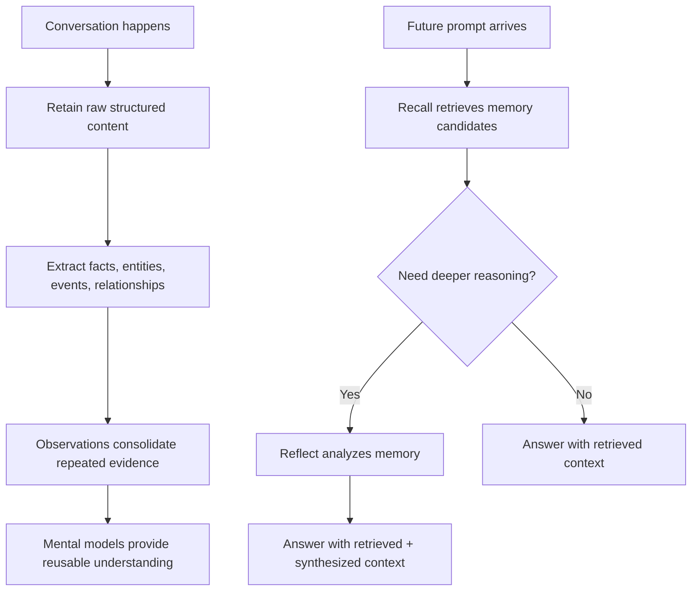

# Hindsight core functions

This page is infographic copy and onboarding text for explaining how Hindsight memory works.

## One-sentence model

**Hindsight is a memory system that separates storage, retrieval, and reasoning.**

```text
Retain  = store memory
Recall  = retrieve memory
Reflect = analyze memory
```

Everything happens inside a **Memory Bank**, which controls memory scope and prevents leakage.

## Core functions

### Memory Bank — isolated memory namespace

A memory bank decides which memories belong together.

Use memory banks to separate users, projects, agents, work vs personal memory, and sensitive vs general memory. A bank can have its own mission, such as “remember durable project architecture decisions” or “remember cross-project user preferences.”

**Why it matters:** memory banks prevent leakage, simplify governance, and make memory easier to inspect.

### Retain — store raw experience

Retain writes source material into Hindsight after a conversation turn, agent session, document, note, log, decision, or event.

Best input:

- structured JSON conversation
- raw notes
- documents
- logs with context
- session deltas
- decisions with source information

Avoid:

- pre-summarized content when raw content exists
- random `document_id`s
- missing `context`
- mixing unrelated projects
- retaining recalled memory back into memory

Retain does not mean “store this exact wording as final truth.” It means “here is source material; extract useful memory from it.”

**Purpose:** store raw data so the system can extract truth.

### Recall — retrieve relevant memory candidates

Recall searches memory before an AI generates an answer.

Recall answers: “What past memories are relevant to this current query?”

Recall is query-dependent. Different prompts should retrieve different memories. Recall may use semantic search, keyword matching, graph relationships, temporal ranking, tags, and filters.

Use recall for giving an agent useful context, retrieving past facts, remembering project decisions, recalling user preferences, and grounding current work in past sessions.

**Killer rule:** recall returns candidates, not answers.

**Purpose:** bring relevant past memory into the current moment.

### Reflect — analyze memory for this question

Reflect performs ad-hoc, agentic analysis over memory. It is not normal search. It asks Hindsight to reason across memories and synthesize an answer for a specific question.

Reflect answers: “Analyze the memories and reason through this question now.”

Use reflect for:

- investigating patterns
- comparing past decisions
- finding contradictions
- understanding changes over time
- synthesizing lessons from many sessions
- answering complex “why did this happen?” questions
- doing ad-hoc project or workflow analysis

Reflect is less ideal for stable recurring summaries like user profiles, coding preferences, project architecture overviews, or always-on assistant guidance. Those fit better as mental models.

**Purpose:** memory-grounded reasoning for one specific question.

### Observations — facts learned from repetition

Observations are consolidated beliefs created from retained memories. They are usually not written directly by the app. Hindsight creates and updates them after retain.

Examples:

- “User consistently prefers simple, minimal tooling.”
- “This project favors project-scoped memory over global shared memory.”

Observations can gather repeated evidence, strengthen over time, weaken when contradicted, become stale, and preserve supporting source memories.

**Brutal distinction:** observations are facts learned from repetition.

**Purpose:** reduce duplicate evidence into durable knowledge.

### Mental Models — reusable answers to recurring questions

Mental models are persistent syntheses over memory. They are useful when the same kind of memory question comes up often.

Good mental model examples:

- “What are this user’s coding preferences?”
- “What is this project’s architecture?”
- “How should this agent collaborate with this user?”
- “What recurring workflow habits matter?”
- “What does this project consider good design?”

Mental models are not raw recall. They are reusable synthesized answers. In Pi Hindsight they are explicit advanced resources (setup / hub `t` / agent control plane). The extension must not auto-create mental models from routine sessions. Starter suggestions are documented in [`starter-mental-model-suggestions.md`](starter-mental-model-suggestions.md). Evaluation alignment notes: [`coding-memory-evaluation.md`](coding-memory-evaluation.md).

Creating a mental model preserves a source query. Hindsight runs that query through reflect and stores the generated content. Bundled templates set `trigger.mode: delta` and `refresh_after_consolidation: true` so consolidation folds new observations without full rewrites every time (server-side; not a Pi background job).

Agents should treat missions and mental models as tunable policy: propose improvements with dry-run tools, do not mutate silently. See [Mission and mental-model quality](mission-and-mental-model-quality.md).

```text
Observations  = facts learned from repetition
Mental Models = answers built from remembered facts
```

**Purpose:** provide fast, consistent high-level memory understanding.

## Do / Don’t

### Do

- Store raw, contextual data.
- Use consistent `document_id`s.
- Set useful `context`.
- Tag aggressively.
- Separate unrelated memory into banks.
- Use recall before answer generation.
- Use reflect for deeper ad-hoc analysis.
- Use mental models for recurring stable context.

### Don’t

- Summarize before retain when raw data exists.
- Use random document IDs for the same source.
- Mix unrelated projects in one memory bank.
- Store recalled memory back into memory.
- Use metadata as the main filter.
- Rely on recall alone for complex analysis.
- Treat observations and mental models as the same thing.

## Common failure modes

| Failure          | Result                                          | Fix                                                                       |
| ---------------- | ----------------------------------------------- | ------------------------------------------------------------------------- |
| Bad retain       | missing context → weak extraction → weak recall | retain raw structured data, add clear `context`, use stable `document_id` |
| No tags          | wrong memories retrieved                        | tag by project, user, source; use strict filtering when scope matters     |
| No reflect       | shallow answers for complex questions           | use recall for candidates and reflect for analysis                        |
| Too many banks   | fragmented knowledge                            | separate only meaningful scopes; use tags inside banks when enough        |
| Too much summary | lost evidence                                   | retain raw source when possible                                           |

## Important supporting fields

### `context`

Tells Hindsight what kind of content is being retained.

Example: `Pi coding session for repo pi-hindsight`

**Purpose:** improve extraction quality.

### `document_id`

Stable ID for the same source document or session.

Same `document_id` means: “this is more content for the same memory source.”

**Purpose:** prevent duplicate memory documents.

### `update_mode`

Controls how retained content updates an existing document.

Use `append` for live ongoing sessions and incremental logs. Use `replace` for deterministic historical imports, full rebuilds, or reprocessing the same source from scratch.

**Purpose:** control whether new memory extends or replaces a source document.

### `tags`

Tags control scope and filtering.

Examples: `user:luxus`, `repo:pi-hindsight`, `session:abc123`, `source:pi`, `harness:pi`.

**Purpose:** recall the right memories and avoid cross-scope leakage.

### `metadata`

Metadata stores provenance.

Use tags for filtering. Use metadata for traceability.

**Purpose:** trace memory back to its source.

### `timestamp`

Gives temporal context.

**Purpose:** support recency ranking, timeline reasoning, change detection, and stale-vs-current judgment.

### Observation scopes

Observation scopes tell Hindsight how to group evidence when creating observations.

Examples: `["harness:pi"]`, `["repo:pi-hindsight"]`, `["user:luxus"]`.

**Purpose:** keep consolidated knowledge in the right scope.

## Simple flow



## Function summary

```text
Memory Bank   = isolated memory namespace
Retain        = store raw experience
Recall        = retrieve relevant memory candidates
Reflect       = ad-hoc analysis over memory
Observations  = facts learned from repetition
Mental Models = answers built from remembered facts
```

## Infographic generation prompt

Use this prompt with ChatGPT or another image/layout model:

```text
Create a clean technical infographic explaining Hindsight memory core functions for AI agents.

Audience: developers and technical product people. Style: modern, minimal, high-contrast, readable in 30 seconds. Use a dark or light professional SaaS style. Avoid clutter. Use simple icons and clear arrows.

Main title:
Hindsight Core Functions

Top banner:
Hindsight separates storage, retrieval, and reasoning.
Retain = store memory. Recall = retrieve memory candidates. Reflect = analyze memory.

Section 1: Memory Bank
Label: Isolated memory namespace
Text: Controls which memories belong together. Prevents leakage and simplifies governance.
Examples: users, projects, agents, work vs personal.

Section 2: Retain
Label: Store raw experience
Text: Writes raw contextual source material into memory so Hindsight can extract facts, entities, relationships, observations, and changes over time.
Do: raw JSON, notes, documents, logs with context.
Avoid: summaries when raw data exists, random document IDs, missing context.

Section 3: Recall
Label: Retrieve relevant memory candidates
Text: Searches memory before an answer. Recall returns candidates, not answers.
Signals: semantic search, keywords, graph relationships, time, tags.

Section 4: Reflect
Label: Analyze memory for this question
Text: Ad-hoc agentic analysis over memories. Use for patterns, contradictions, decision evolution, lessons, and why/how questions.
Note: user profiles and recurring summaries fit Mental Models better.

Section 5: Observations
Label: Facts learned from repetition
Text: Auto-generated beliefs created from repeated evidence. Can strengthen, weaken, or become stale.

Section 6: Mental Models
Label: Answers built from remembered facts
Text: Reusable stable understanding for recurring questions like user preferences, project architecture, and collaboration style.

Add a small distinction strip:
Observations = facts learned from repetition.
Mental Models = answers built from those facts.
Reflect = ad-hoc analysis for one question.

Add a DO / DON’T strip:
DO: store raw contextual data; use stable document_id; tag aggressively; separate unrelated memory.
DON’T: summarize before retain; use random IDs; mix unrelated memory; treat recall as final answer.

Add a flow diagram:
Conversation → Retain → Extraction → Observations → Mental Models
Future prompt → Recall → optional Reflect → Answer with retrieved + synthesized context

Output: one-page infographic, strong visual hierarchy, concise text, enough whitespace, developer-friendly.
```
